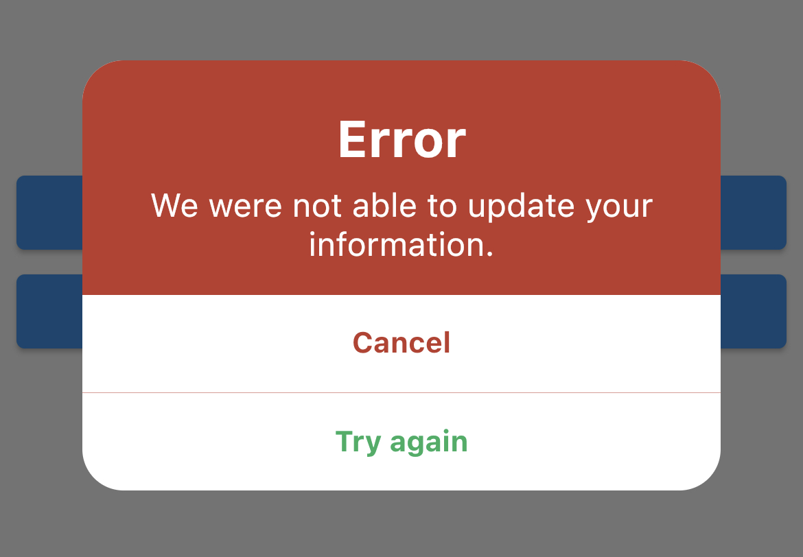

clean_dialog

A clean and minimalist dialog Supports null-safety and Flutter 3

## Features

- Customisable
- Lightweight 

## Usage

Sample Alert
```
showDialog(
    context: context,
    builder: (context) => CleanDialog(
    title: 'Error',
    content: 'We were not able to update your information.',
    backgroundColor: const Color(0XFFbe3a2c),
    titleTextStyle: const TextStyle(fontSize: 25, fontWeight: FontWeight.bold, color: Colors.white),
    contentTextStyle: const TextStyle(fontSize: 16, color: Colors.white),
    actions: [
        CleanDialogActionButtons(
            actionTitle: 'Cancel',
            onPressed: () => Navigator.pop(context),
        ),
        CleanDialogActionButtons(
            actionTitle: 'Try again',
            textColor: const Color(0XFF27ae61),
            onPressed: () {},
        ),
    ],
    ),
);
```
Output



